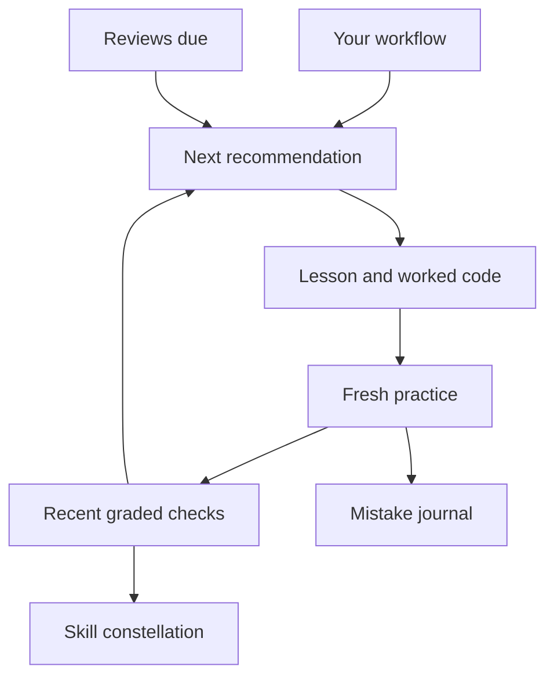

<div align="center">


# DSA Verse

### The art of thinking. One good problem at a time.

An adaptive learning atelier for data structures and algorithms.<br/>
Read an idea. Trace it. Try it. Keep the lesson that the mistake taught you.


[The experience](#a-studio-built-around-your-progress) · [Start locally](#open-your-own-atelier) · [Deploy](#put-it-on-vercel) · [How it adapts](#how-the-tutor-chooses-your-next-step)

</div>

---

## A studio built around your progress

DSA Verse turns a list of topics into a daily practice. The tutor chooses the next concept from your graded work, returns to ideas that need reinforcement, and gives your progress a connected, visible shape.

| On the canvas                     | What you can do                                                                                                                                                  |
| --------------------------------- | ---------------------------------------------------------------------------------------------------------------------------------------------------------------- |
| **Your personal workflow**        | Set your daily time, learning pace, preferred language, goal, and topic focus.                                                                                   |
| **A sequential learning path**    | Work through 16 topics, from complexity to graphs, dynamic programming, and tries.                                                                               |
| **A skill constellation**         | Explore a zoomable network of concepts, prerequisite connections, mastery rings, and the recommended next step.                                                  |
| **Practice chosen for you**       | Get parameterized original checks, hints, explanations, and 32 curated LeetCode placements across the curriculum. Some challenges appear in more than one topic. |
| **C, Java, and Python**           | Study examples in all three languages. Edit, save, copy, and download separate code drafts for each topic and language.                                          |
| **A clearer measure of progress** | Take a six-question starting assessment; track recent accuracy, independence, mastery estimates, practice activity, and streaks.                                 |
| **A place for useful mistakes**   | Save your reasoning, revisit hinted or incorrect answers, and write takeaways in the mistake journal.                                                            |
| **A review rhythm**               | Revisit strong topics after 3 or 7 days and reinforce weaker topics sooner.                                                                                      |
| **Quiet focus**                   | Use a 15–60 minute focus timer and record completed sessions. Earn milestones from actual activity.                                                              |
| **Algorithms in motion**          | Step through linear and binary search; watch candidates disappear and comparisons accumulate.                                                                    |
| **The hackathon observatory**     | Browse global news and developer-community coverage, filter by region or subject, bookmark stories, and follow original sources.                                 |
| **Progress you can keep**         | Explicit device storage, JSON export/import, and optional Supabase account sync.                                                                                 |

### Four ways to light your canvas

| Palette             | Mood                                                                      |
| ------------------- | ------------------------------------------------------------------------- |
| **Sunlit atelier**  | Warm canvas, cobalt blue, and ochre. The original painting-inspired home. |
| **Midnight ink**    | Deep indigo, softer surfaces, and moonlit gold.                           |
| **Botanical study** | Forest green and the warmth of handmade paper.                            |
| **Modern gallery**  | Crisp white, charcoal, and a touch of vermilion.                          |

Choose **Change theme** in the sidebar. The selection persists on your device and is applied before the page paints.

## How the tutor chooses your next step

The adaptive engine is transparent and deterministic. It does not require an AI API key or pretend that reading a lesson proves mastery.

1. **Retrieve a due review.** Topics at 70–89% return after 3 days; topics at 90% or above return after 7 days.
2. **Respect your chosen focus.** A manual topic focus takes priority over the normal sequence.
3. **Find the next learning gap.** The engine chooses the first topic below your pace threshold: gentle **85%**, balanced **70%**, or intensive **65%**.
4. **Keep practising.** Once all topics clear the threshold, the weakest topic becomes the next recommendation.

Mastery uses the **six most recent graded checks per topic**, with newer answers weighted more. Independent correct answers receive full credit; correct answers with hints receive 65% credit. A confidence factor ramps up over the first three checks. Incorrect answers receive no credit. Scores are learning signals, not a standardized rating or interview-readiness certificate.

LeetCode outcomes are explicitly **self-reported** and do not inflate graded mastery. Original questions are generated from 48 teaching templates with variable inputs; they are not an unlimited AI-generated problem bank.



## A window onto the world's hackathons

The Node.js API at `/api/hackathons` reads five Google News RSS editions — **US, India, UK, Australia, and Singapore** — plus **DEV Community** articles tagged `hackathon`.

The feed parses titles, links, publishers, and publication dates; removes duplicate titles; sorts recent coverage first; and infers subject tags and possible locations. Filters include AI/ML, Web3, climate, health, students, and regional views. Coverage can include announcements, recaps, and community challenges.

- Publication dates are labelled as publication dates. Registration deadlines are never invented.
- Regions inferred from headlines are labelled; otherwise the card identifies the news edition.
- Stories link to their source. Check the organiser for event dates, registration, eligibility, and fees.
- Fixed source URLs, bounded response sizes, XML declaration checks, per-source timeouts, and independent error handling keep one failed source from breaking the feed.
- Results are cached for 15 minutes. A warm server instance can retain its previous feed during an outage; this is not a permanent news archive. **Refresh news** respects the shared cache.

The observatory is a discovery feed, not an exhaustive or verified global event calendar. It needs outbound access to Google News and DEV; source availability varies.

## Open your own atelier

Use **Node.js 22.13+** and the pnpm version declared in `package.json`.

```bash
git clone https://github.com/yupitsmegd7/DSA_Verse.git
cd DSA_Verse
corepack enable
pnpm install --frozen-lockfile
pnpm dev
```

Open **http://localhost:3000** and choose **Use this device**. No environment variables are needed for device storage or the public news feed.

```bash
pnpm test       # Learning engine, backup merge, and news parser tests
pnpm typecheck  # TypeScript validation
pnpm build     # Production build
pnpm start     # Run the production build
```

For a network that requires an HTTP proxy, configure the Node runtime's supported proxy settings. Production hosting normally accesses the fixed news sources directly.

## Put it on Vercel

Import this repository in [Vercel New Project](https://vercel.com/new). The included `vercel.json` selects Next.js and the pnpm install/build commands.

| Setting               | Value                                                             |
| --------------------- | ----------------------------------------------------------------- |
| Repository            | `yupitsmegd7/DSA_Verse`                                           |
| Production branch     | `main`                                                            |
| Framework             | Next.js                                                           |
| Root directory        | Repository root                                                   |
| Install command       | `pnpm install --frozen-lockfile`                                  |
| Build command         | `pnpm build`                                                      |
| Output directory      | Next.js default                                                   |
| Environment variables | `ENABLE_EXPERIMENTAL_COREPACK=1`; two additional public values for optional account sync |

Before the first deployment, add `ENABLE_EXPERIMENTAL_COREPACK` with value `1` in Vercel's Environment Variables section. This makes Vercel use the `pnpm@11.25.0` version pinned in `package.json`, rather than a default pnpm version. Select Node.js **22.x** in the project settings; leave the Next.js output directory at its default. See [Vercel's Corepack configuration](https://vercel.com/docs/builds/configure-a-build#corepack).

Deploying requires a Vercel account with access to this GitHub repository. With an authenticated Vercel CLI you can also run `vercel --prod` from the project directory. After deployment, verify `/api/hackathons`, switch themes, and save/reload a practice attempt.

### Optional account sync

1. Create a Supabase project and run [`supabase/schema.sql`](supabase/schema.sql) once in its SQL editor.
2. Enable email/password authentication. Configure the site URL and permitted redirect URLs for your deployment; configure email delivery for public sign-ups.
3. Copy [`.env.example`](.env.example) to `.env.local` for local development, or set these values in Vercel's environment settings:

   ```dotenv
   NEXT_PUBLIC_SUPABASE_URL=https://YOUR-PROJECT.supabase.co
   NEXT_PUBLIC_SUPABASE_PUBLISHABLE_KEY=YOUR-PUBLISHABLE-KEY
   ```

4. Redeploy after changing public environment variables. Open **Progress & backups**, then create an account or sign in.

Only use the **publishable** (or legacy anonymous) key here. Never put a service-role key in a `NEXT_PUBLIC_` variable. Row-level security restricts each workspace to its authenticated owner. Version checks protect against concurrent updates.

Device and account workspaces are separate. To move your work, export from the current workspace, switch, then import the backup. Imports merge attempts, lessons, drafts, bookmarks, and focus sessions without duplicating attempt IDs; current workflow settings are retained. Device storage belongs to a specific browser and origin. Old Algo Atelier cloud records are not automatically migrated to this independent Vercel application.

## Inside the frame

| File or directory             | Purpose                                                          |
| ----------------------------- | ---------------------------------------------------------------- |
| `app/studio.tsx`              | Dashboard, sequential path, lessons, diagnostics, and journal    |
| `app/features.tsx`            | Themes, graph, workbench, review queue, timer, news, and backups |
| `app/globals.css`             | Painting-inspired design system and four theme palettes          |
| `app/api/hackathons/route.ts` | Cached public news endpoint                                      |
| `lib/curriculum.ts`           | Lessons, question templates, mastery, and recommendation rules   |
| `lib/java.ts`                 | Java examples for every topic                                    |
| `lib/state.ts`                | Validated workspace actions and backup merging                   |
| `lib/storage.ts`              | IndexedDB persistence and optional Supabase sync                 |
| `lib/news.ts`                 | RSS parsing, community ingestion, tagging, and deduplication     |
| `supabase/schema.sql`         | Account storage and row-level security policies                  |
| `tests/`                      | Regression tests for learning and ingestion behavior             |

### Deliberate boundaries

Code drafts are a learning scratchpad. **Code execution happens in the linked external compiler or on LeetCode**; this application does not run untrusted C/Java/Python or grade arbitrary submissions. LeetCode submissions are not imported automatically. There is no LLM chatbot, paid API dependency, background notification service, or automatic account provisioning.

The generated oil-painting illustration lives in `public/atelier-painting.webp`. UI primitives use shadcn/Radix and Lucide icons; the vendored stylesheet retains its upstream license in `vendor/`.

---

<div align="center">

**A little structure. Room to grow.**

Made for Gourav Dutta · [MIT License](LICENSE)

</div>
